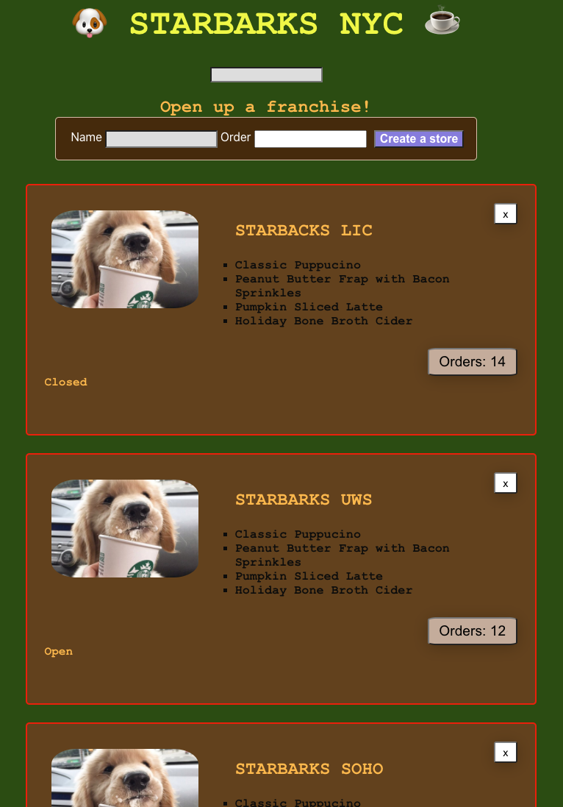

# Starbarks 🐶⭐️

Description Coming soon!

## Features
### Serializers
 * Building linear direction on the relationships and model association in the back end 
### CRUD Operation
 User can to:
  * coming soon!
  * coming soon!
  * coming soon!
  * coming soon!
  
### Active Record Associations
 * * coming soon!
## Domain Model

 </img>

## Wireframe

* coming soon!

## Tech Stack
 * React
 * Ruby on Rails
 * Rails as an API
 * PostgreSQL
 * HTML/CSS
 * Active Record
## Tools
 * coming soon!
## Gems 
 * rack-cors
 * active_model_serializers
## Build Status
 * coming soon!
## Next Steps
 * coming soon!
 
 ## Setup for running this application
 
 * coming soon!
 
## Creator
 * [Anna Kim](https://github.com/iannakim)
 
## Acknowledgements
 We would like to thank:
  * Eric Kim
  * Sylwia Vargas
  * Annie Zheng
  * Isabel K. Lee
